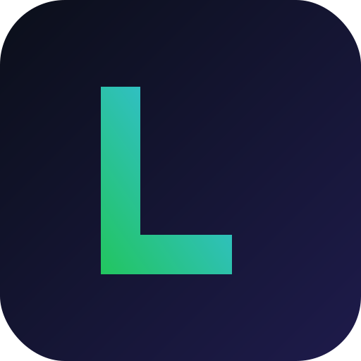

# 🚀 Lifemax — your life-maxing dashboard

A private, offline dashboard to track **goals, stats and accountability** across five life domains:

💰 Money · 🏋️ Fitness · 📚 Study · 🚀 Career · 📈 Business

Everything you see is editable, and **all your data stays on your own device** (nothing is uploaded anywhere). It installs to your taskbar/dock like a real app so you can keep it pinned as a daily reminder.



---

## ✨ What's inside

- **Overview page** — a single "Life Score" ring, plus a card per domain showing progress at a glance.
- **Per-domain pages** with:
  - **Key metrics** — click any stat to log today's value; it updates the chart.
  - **History chart** — switch between metrics to see trends over time.
  - **Goals** — progress bars with quick +/- buttons; add your own goals.
  - **Daily accountability** — tick off habits each day and build 🔥 streaks.
- **Export / Import** your data as a backup file, or **Reset** to the demo sample.
- **Installable app** — pin it to your laptop and keep it always visible.

> On first launch it's filled with realistic **sample data** so the charts look alive. Hit **Reset** (top-right) any time, or just edit the numbers to make it yours.

---

## 🟢 Getting started (no experience needed)

You need **Node.js** installed (v18+). If you don't have it, download the "LTS" version from <https://nodejs.org> and run the installer — just click Next through it.

Then, open a terminal **in this project folder** and run these two commands:

```bash
npm install      # one time only — downloads the building blocks
npm run dev      # starts the app
```

You'll see a line like `Local: http://localhost:5173/`. **Hold Ctrl (or Cmd on Mac) and click that link**, or paste it into Chrome/Edge. That's your dashboard! 🎉

To stop it, click in the terminal and press `Ctrl + C`.

---

## 📌 Pin it to your laptop (the fun part)

Once it's open in **Chrome or Edge**:

1. Click the **"⤓ Install app"** button in the top-right of the dashboard
   *(or use the install icon in the browser's address bar)*.
2. It now opens in its own window — **right-click its taskbar/dock icon → Pin**.

**Make it float on top of everything (a constant reminder):**

- **Windows** — install Microsoft *PowerToys* (free, from the Microsoft Store). Focus the Lifemax window and press **`Win + Ctrl + T`** to keep it always on top. Press again to turn off.
- **Mac** — use a free tool like *Afloat* / *Rectangle*, or drag it to its own Space/Stage Manager slot so it's always one swipe away.

---

## 💾 Where's my data? Will I lose it?

- Your data is stored in the browser's **localStorage** on this device — private and instant.
- It **persists** between sessions as long as you use the same browser/profile.
- To be safe (or to move to a new computer), click **⤓ Export** to download a backup file, and **⤴ Import** to restore it.
- Clearing your browser data, or using the **Reset** button, will wipe it — so export occasionally.

---

## 🛠️ Make it your own

Want different metrics, goals or even a new domain? It's all driven by one file:

```
src/lib/domains.js
```

Each domain lists its `trackers` (the metrics/charts) and starter `goals` + `habits`. Copy an existing block, change the labels, and it appears everywhere automatically — no other code to touch.

---

## 📦 Build a shareable version

```bash
npm run build      # creates an optimised app in the dist/ folder
npm run preview    # preview that production build locally
```

The contents of `dist/` can be dropped onto any static host (Netlify, Vercel, GitHub Pages) if you ever want to access it from your phone too.

---

## 🧰 Tech (for the curious)

React + Vite · Tailwind CSS v4 · Recharts (charts) · vite-plugin-pwa (installable/offline). No server, no database, no account.
