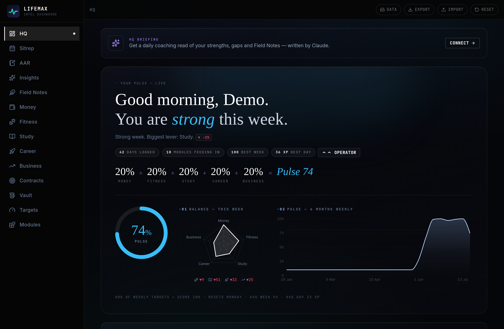

# Lifemax

**A local-first life dashboard.** Track money, fitness, study, career and side-business in one place, get a single weekly **Pulse** score for how you're actually living, and earn XP toward the treats you define. No server, no account, no telemetry — your data never leaves your browser.



---

## What's inside

- **Pulse** — one honest 0–100 score for the week, built from your own targets across every active life domain, with a letter grade, week-over-week delta, 6-month trend and a balance radar.
- **💰 Money** — income sources, transactions tagged spending / saving / investment, savings rate against target.
- **🏋️ Fitness** — runs, workouts, stretching, steps and wake-up time against weekly/daily targets; heatmaps and rings.
- **📚 Study** — pages read and study hours against weekly targets, plus a prioritised to-do list.
- **🚀 Career** — a job-application pipeline (Applied → Interview → Offer) and per-skill hour tracking.
- **📈 Business** — side-project tracker: hours in, revenue, milestones.
- **⚡ Quick wins** — small daily habits you define, each worth XP.
- **🍺 The Vault** — a points economy. Logged effort earns XP automatically; spend it to unlock the indulgences you set up. Monthly "campaign debriefs" re-weight what your habits are worth.
- **🎯 Contracts** — commitment stakes: put something on the line, link it to a target, and Lifemax auto-judges the outcome.
- **📓 Field notes** — one honest minute a day: mood, today's win, tomorrow's plan.
- **🤖 AI coach** *(optional)* — plug in your own Anthropic API key and Claude reads your week, gives a morning/evening briefing, runs your weekly review and monthly debrief interactively.
- **💎 Insights** — Lifemax reads your whole record and tells you what it noticed: streaks, records, weekday effects, mood-vs-movement links, follow-through rate — each graded **Common → Mythic** and collected over time. Computed locally from your own data; the Mythic one only surfaces once your record runs deep enough.
- **🧩 Modular by design** — every feature above is a module. Switch modules on/off (data kept), reorder them, tune how much each weighs in your Pulse, and arrange the HQ widgets — all from the **Modules** page.
- **🛠️ Build your own trackers** — create custom modules in-app, no code: name it, add metrics (counters, numbers, checkboxes), set weekly targets and XP. They score, earn and chart exactly like built-ins. Developers can go further with code modules — see [docs/MODULES.md](docs/MODULES.md).
- **Installable PWA** — pin it to your dock/taskbar; works fully offline.

Want to see it alive? Open the app → **Data** (top-right) → **Load demo data** for six weeks of sample activity (your real data is snapshotted first).

---

## Quickstart

You need [Node.js](https://nodejs.org) 18+.

```bash
npm install
npm run dev
```

Open the printed `http://localhost:5173/` link. That's it — there is nothing else to configure.

```bash
npm run build      # production bundle in dist/
npm run preview    # serve that bundle locally
```

---

## Deploy your own

Lifemax is a static site — every user's data lives in *their* browser, so one deployment serves everyone with zero shared state.

**GitHub Pages (built in):**

1. **Fork** this repo.
2. In your fork: **Settings → Pages → Build and deployment → Source: GitHub Actions**.
3. Push to `main` (or run the *Deploy to GitHub Pages* workflow manually). Your app appears at `https://<your-username>.github.io/Lifemax/`.

**Anywhere else:** `npm run build` and drop `dist/` on any static host (Netlify, Vercel, Cloudflare Pages…). If the app won't be served from `/Lifemax/`, set the base path at build time:

```bash
VITE_BASE=/ npm run build
```

---

## Your data

- Everything is stored in your browser's **localStorage** — private, instant, offline.
- **Rolling backups**: the app snapshots your data daily and before anything destructive (import, restore, reset). Restore any of the last 7 snapshots from the **Data** modal.
- **Export / Import**: download your entire history as one JSON file; import it on any other device. Do this occasionally — clearing browser data wipes localStorage.
- **Data file (Chrome/Edge)**: from the **Data** modal, link a `lifemax-data.json` file and the app mirrors every change into it live. Keep that file in Dropbox/iCloud/Syncthing and open Lifemax on another machine pointing at the same file — changes are **merged** (union of both sides' logs), not overwritten. Best used one device at a time.
- **No env vars, no keys, no server.** The optional AI coach uses your own Anthropic API key, which is stored only in your browser's localStorage and sent only to Anthropic, directly from your browser.

---

## Architecture (for the curious)

React 18 + Vite · Tailwind CSS v4 (CSS-first config) · Recharts · vite-plugin-pwa. Plain JavaScript, no TypeScript.

- **Everything is a module.** Each feature lives in `src/modules/<id>/` and declares its contributions in a manifest — page, collapsed summary, HQ widget, Pulse scorer, XP rules, AI-digest fragment, stake targets, settings card. The registry (`src/lib/registry.js`) composes whatever is registered; adding a feature is a folder plus one line in `src/modules/index.js`. Full guide: [docs/MODULES.md](docs/MODULES.md).
- **One state blob.** The whole app state is a single versioned object owned by `src/lib/store.jsx` (React context + actions), persisted to localStorage with debounce and migrated on load — old exports import forever. Modules seed and migrate their own slices.
- **Derived, not stored.** The Pulse (`src/lib/score.js`) and the XP economy (`src/lib/xp.js`) are engines that fold over module contributions on every render — editing history recalculates everything cleanly, and user preferences (enable/disable/order/weights) reshape the numbers instantly.
- **Custom trackers are data-defined modules**: definitions live in your state blob and are bridged into real manifests at runtime (`src/modules/custom.jsx`) — so they ride through the same registry, scoring and XP paths as built-ins.
- **Tests**: `npm test` (vitest) covers migration compatibility, the two-copy merge, scoring under preferences, and the registry.

---

## Contributing

Issues and PRs welcome — see [CONTRIBUTING.md](CONTRIBUTING.md).

## License

[MIT](LICENSE)
